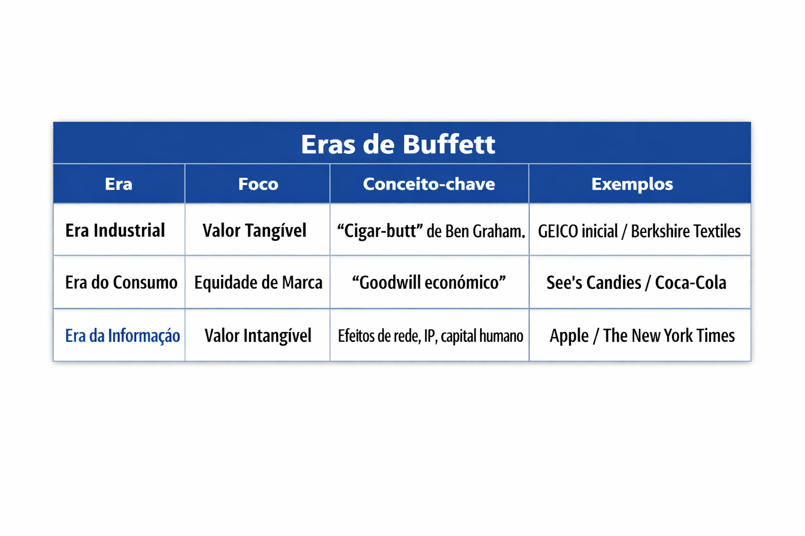
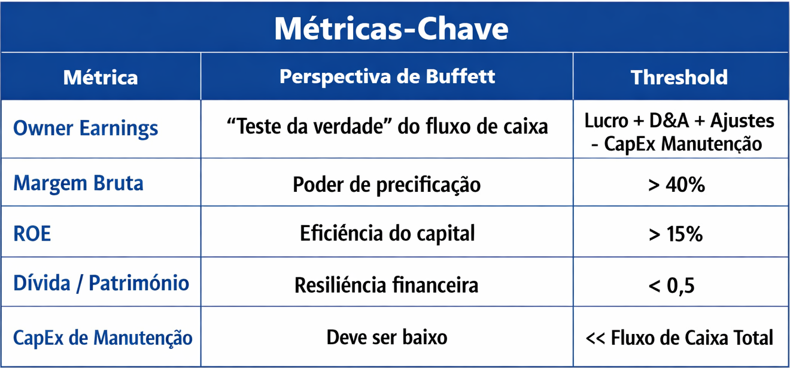

# 📊 Análise do Alpha de Investimento de Warren Buffett e sua Estratégia Evolutiva

## 📌 Resumo Executivo
Este documento sintetiza pesquisas extensas e dados de desempenho sobre a metodologia de investimento de Warren Buffett e da Berkshire Hathaway. Historicamente, Buffett alcançou um **índice de Sharpe de aproximadamente 0,79**, superando qualquer outro fundo ou ação com histórico superior a 30 anos. A análise quantitativa profunda revela que seu sucesso não é fruto de “sorte ou mágica”, mas derivado de uma exposição sistemática a fatores específicos — principalmente ações de **Qualidade** e de **Baixo Beta** — amplificados por uma alavancagem estável e de baixo custo.

Embora Buffett tenha começado como um investidor tradicional de valor, focado em ativos tangíveis, sua estratégia evoluiu para o conceito de **“Valor Intangível”**, favorecendo empresas leves em ativos, mas com **moats competitivos duradouros**. Dados recentes indicam que o portfólio público de ações da Berkshire supera consistentemente suas participações privadas, sugerindo que sua principal vantagem está na seleção de ações, e não na gestão operacional. À medida que a empresa se aproxima de um valor de mercado de US$ 1 trilhão, enfrenta desafios estruturais relacionados ao tamanho crescente de seu capital e a um “círculo de competência” cada vez mais estreito em uma economia dominada pela tecnologia.

---

## 1. Fundamentos Quantitativos: Decompondo o Alpha de Buffett

### Exposição a Fatores de Risco
O estudo **“Buffett’s Alpha”** (Frazzini, Kabiller e Pedersen) mostra que o “alpha” de Buffett se torna estatisticamente insignificante quando controlado por dois estilos de investimento:

- **Betting Against Beta (BAB):** preferência por ações seguras e de baixa volatilidade.  
- **Quality Minus Junk (QMJ):** foco em empresas lucrativas, seguras e com alto payout.

### O Papel da Alavancagem
Os retornos de Buffett são ampliados pelo uso de alavancagem média de 1,6–1,7 vezes, sustentada por:

- **Float de Seguros:** capital proveniente dos prêmios recebidos antes do pagamento de sinistros, muitas vezes com custo negativo.  
- **Natureza Não-Recursal:** diferente de empréstimos de margem, não há risco de liquidação forçada em crises.

### Público vs. Privado
Pesquisas indicam que o portfólio público da Berkshire supera suas aquisições privadas em cerca de 30%, reforçando que o diferencial de Buffett está na seleção disciplinada de ações.

---

## 2. Evolução Estratégica: Dos “Cigar-Butts” aos Moats Intangíveis

Buffett passou de comprar ações baratas estatisticamente para adquirir **empresas de alta qualidade a preços justos**, priorizando ativos leves e moats intangíveis.

---

## 3. Framework de Avaliação de Buffett

### Seis Critérios Financeiros
1. Lucro líquido mínimo de US$ 10 milhões.  
2. Histórico consistente de lucros.  
3. Alto ROE com pouca ou nenhuma dívida.  
4. Gestão já estabelecida.  
5. Negócios simples (evitando tecnologia complexa).  
6. Preço de oferta definido (sem leilões hostis).

---

## 4. Estudos de Caso

- **GEICO:** exemplo inicial de “cigar-butt”, depois motor do float de seguros.  
- **See’s Candies:** paradigma da qualidade, com moat de precificação.  
- **Apple:** pivot moderno para ativos intangíveis, com moat de ecossistema.

---

## 5. Desafios e Legado Institucional

### O Problema do Trilhão
Com valor de mercado próximo a US$ 1 trilhão, a Berkshire enfrenta dificuldade em encontrar oportunidades que “movam a agulha”, acumulando caixa recorde de 30%.

### Transição e Expansão
Sob Greg Abel, há sinais de expansão do círculo de competência:  
- **Internacionalização:** investimentos em empresas japonesas.  
- **Pivot Digital:** foco em modelos de assinatura digital.

---
Ótimo, João! Vamos incluir as **questões e respostas** como um tópico único dentro do documento traduzido sobre o *Investment Alpha e a Estratégia Evolutiva de Warren Buffett*. Assim, o briefing fica completo e bem estruturado.  

Aqui está a versão revisada com a nova seção:

---

# 📊 Análise do Alpha de Investimento de Warren Buffett e sua Estratégia Evolutiva

*(mantém todo o conteúdo traduzido que você já tem: Resumo Executivo, Fundamentos Quantitativos, Evolução Estratégica, Framework de Avaliação, Estudos de Caso, Desafios e Conclusão)*

---

## ❓ Questões Fundamentais

### Quais são as regras fundamentais de Warren Buffett para ficar rico?
**R:** As regras fundamentais de Buffett para acumular riqueza baseiam-se na filosofia de **preservação de capital** e crescimento composto a longo prazo.  
- **Regra nº 1:** Nunca perder dinheiro.  
- **Regra nº 2:** Jamais esquecer a regra nº 1.  

Buffett enfatiza a diferença entre **preço e valor**, com o mantra: *“O preço é o que você paga, mas o valor é o que você recebe”*.  

Diretrizes práticas:  
- **Círculo de Competência** → Invista apenas no que entende profundamente.  
- **Margem de Segurança** → Compre ações com desconto em relação ao valor intrínseco.  
- **Fossos Econômicos** → Procure empresas com vantagens competitivas duráveis.  
- **Temperamento Racional** → Seja cauteloso quando os outros são gananciosos e vice-versa.  
- **Foco na Qualidade** → Prefira empresas excelentes a preços justos.  
- **Owner Earnings** → Analise o fluxo de caixa real.  
- **Visão de Longo Prazo** → O período favorito para manter uma ação é “para sempre”.  
- **Gestão de Excelência** → Associe-se a gestores íntegros e competentes.  
- **Concentração de Ativos** → Aposte em poucas empresas de alta qualidade.  

---

### O que é o conceito de Margem de Segurança?
**R:** A **Margem de Segurança** é considerada por Buffett o “alicerce do sucesso nos investimentos”, herdada de Benjamin Graham.  
Em termos simples, é a diferença entre o **valor intrínseco estimado** de uma empresa e o **preço pago** por suas ações.  

Pontos principais:  
- **Colchão contra incerteza:** protege contra erros de cálculo ou eventos inesperados.  
- **Analogia da ponte:** se uma ponte suporta 30.000 libras, mas só permite caminhões de 10.000, há margem de segurança.  
- **Evitar perda permanente de capital:** alinhado à regra nº 1 de Buffett.  
- **Decisão óbvia:** deve ser tão clara que não exija cálculos complexos.  
- **Fatores adicionais:** balanço sólido, receitas recorrentes e fossos econômicos fortalecem a margem.  
- **Evolução:** Graham focava em números, Buffett evoluiu para empresas de alta qualidade com moats duradouros.  

---

### Como Buffett utiliza a alavancagem para aumentar seus retornos?
**R:** Buffett utiliza a alavancagem de forma única, principalmente através da **estrutura da Berkshire Hathaway**, com média de 1,6–1,7 vezes.  

Mecanismos:  
- **Insurance Float:** prêmios de seguros recebidos antes das indenizações, muitas vezes com custo negativo.  
- **Impostos Diferidos:** obrigações fiscais adiadas funcionam como empréstimo sem juros.  
- **Amplificação de fatores:** alavancagem estável permite explorar **BAB (Betting Against Beta)** e **QMJ (Quality Minus Junk)**.  

Em resumo, Buffett não usa alavancagem para ativos arriscados, mas para **potencializar ativos seguros e de alta qualidade**, criando uma vantagem competitiva sustentável.

---

## 📌 Conclusão
O legado de Buffett é a transição de um estilo de **stock-picking individual** para uma estratégia sistemática baseada em fatores de **Qualidade e Valor Intangível**. Seu sucesso mostra que a **disciplina comportamental** e a **estrutura de capital estável** são tão importantes quanto a análise fundamentalista para alcançar desempenho superior no longo prazo.

